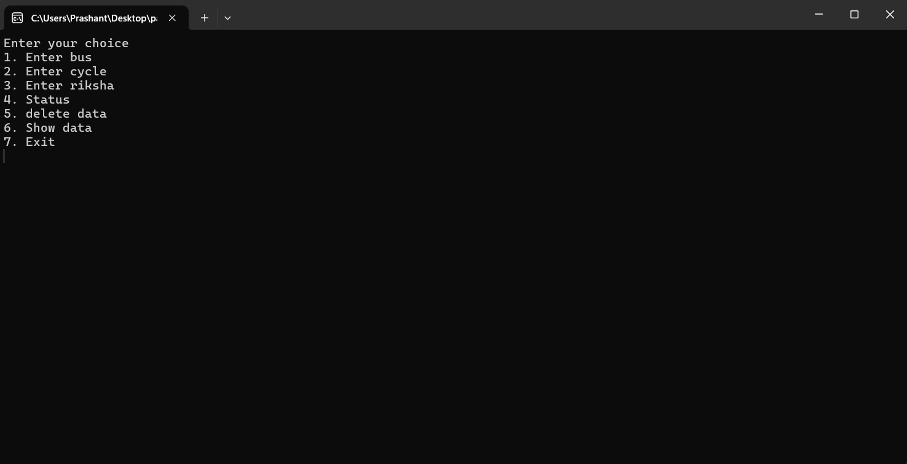

# Parking System Project
## Description
The Parking System Project is a C language application designed to simulate a parking management system. This project provides a user-friendly interface for managing parking operations, including vehicle entry and exit, slot availability, and billing. It serves as a practical example of using fundamental programming concepts, data structures, and file handling in C.

## Table of Contents
- [Features](#features)
- [Technologies Used](#technologies-used)
- [Usage](#usage)
- [Contributing](#contributing)

## Getting Started
To get a copy of this project up and running on your local machine, follow these steps:

1. **Clone the repository:**
   ```bash
   https://github.com/Parshu2496/Parking-system.git
2. **Open the File:**
   Open the File Parking_managment.exe file in command prompt. It will open the file in binary mode. If you run the file in vs code or other application it may not print the correct output because they do not read the file in binary mode.

## Working
1. Compile The Parking_managment.c file after cloning in your pc to Parking_managment.exe.
2. Open the Parking_managment.exe file through terminal so it could read and write in binary.
3. choose the option you want.
   
5. Enter the car Details as asked.
6. Enter 4 to check revenue of full day.
7. Enter 6 to check data of cars.
8. Enter 7 to exit the program.
## Features
- User Information: Takes the Information of vechiles.
- Parking fees Managment: Distribute the fees for your vechile.
- Vehicle Entry and Exit: Register vehicles entering and exiting the parking lot.
- Search Functionality: Easily search for parked vehicles by license plate number.
- Billing Calculation: Automatically calculate parking fees based on the duration of stay.
- Data Persistence: Store parking data in files to maintain information across sessions.

## Technologies Used
    1) C Programming Language
    2) GCC Compiler
    3) Makefile (optional for build automation)
    4)Standard Libraries (stdio.h, stdlib.h, string.h)
    5)File Handling for data storage

## Usage
Upon running the application, follow the on-screen prompts to register, log in, and manage parking operations. The interface is text-based and designed for ease of use.

## Contributing
Contributions are welcome! If you have ideas for enhancements or new features, please fork the repository and submit a pull request.

Feel free to customize this README to better fit your project's specifics and any additional information you want to include!


